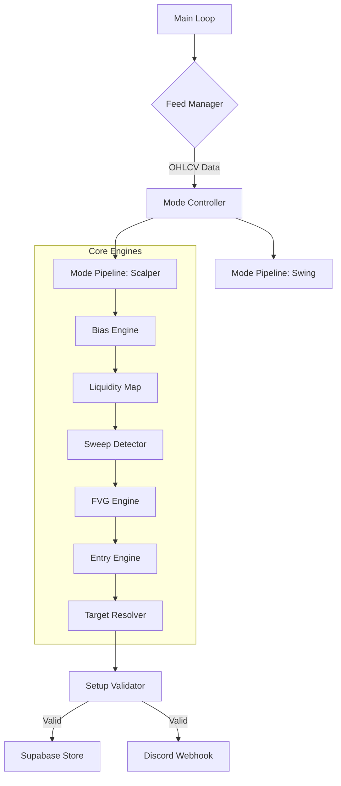

# PHANTOM
**Price Hunt And Market Trap Observation Node**

PHANTOM is a high-performance market observation node designed for Smart Money Concept (SMC) trading. It specializes in detecting liquidity sweeps, market structure breaks (BOS), and Fair Value Gaps (FVG) for intraday trading on Indian markets (NSE + MCX).

---

## 🏗️ Architecture Overview

PHANTOM operates as a state-machine based observation node, synchronizing multiple timeframes to identify high-probability setups.



---

## 🚀 Setup Instructions

### 1. Prerequisites
- Python 3.9+
- Dhan Account (with API access)
- Supabase Project (for data persistence)
- Discord (Optional, for alerts)

### 2. Installation
```bash
# Clone the repository
git clone <repo-url> phantom
cd phantom

# Install dependencies
pip install -r requirements.txt
```

### 3. Database Initialization
Execute the `schema.sql` file in your Supabase SQL Editor to create the necessary `candles` and `phantom_setups` tables.

---

## ⚙️ Configuration (.env)

| Variable | Description | Example |
|----------|-------------|---------|
| `DHAN_CLIENT_ID` | Your Dhan client ID | `1100123456` |
| `DHAN_TOTP_SECRET` | TOTP secret (32-char base32 key) | `JBSWY3DPEHPK3PXP` |
| `SUPABASE_URL` | Your Supabase Project URL | `https://xyz.supabase.co` |
| `SUPABASE_KEY` | Your Supabase API Key | `eyJhbGciOiJIUzI1...` |
| `DISCORD_WEBHOOK_URL` | Discord webhook for alerts | `https://discord.com/api/webhooks/...` |
| `ACTIVE_MODE` | Trading mode: `SCALPER`, `SWING`, or `BOTH` | `BOTH` |
| `ENTRY_TYPE` | Primary entry trigger | `MITIGATION` |

---

## 🛠️ System Components

### 🧠 Core Engines
- **Bias Engine**: Analyzes higher timeframe structure to determine long/short bias.
- **Liquidity Map**: Tracks swing highs/lows and identifies equal highs/lows (BSL/SSL).
- **Sweep Detector**: Monitors for wick violations of liquidity levels followed by a close back inside.
- **FVG Engine**: Detects displacement-grade Fair Value Gaps following a sweep.
- **Entry Engine**: Validates entry triggers (Mitigation, Rejection, or candle-body BOS).
- **Target Resolver**: Calculates TP levels based on risk multiples and opposing liquidity.

### 📊 Data Layer
- **Feed Manager**: Handles real-time polling and historical data fetching via Dhan HQ.
- **Store Manager**: Manages asynchronous persistence to Supabase.

---

## ⌨️ CLI Usage

Standard execution (Default: NIFTY):
```bash
python main.py
```

Run for a specific security (e.g., BANKNIFTY ID: 15):
```bash
python main.py --15
```

Override active mode to Swing only:
```bash
python main.py --15 --SWING
```

---

## 📄 Automated Documentation
API documentation is generated from Google-style docstrings.

```bash
python execution/generate_docs.py
```
Outputs are saved in `directives/api-docs/`.

---

## 📜 License
This project is proprietary and intended for personal trading observation.
